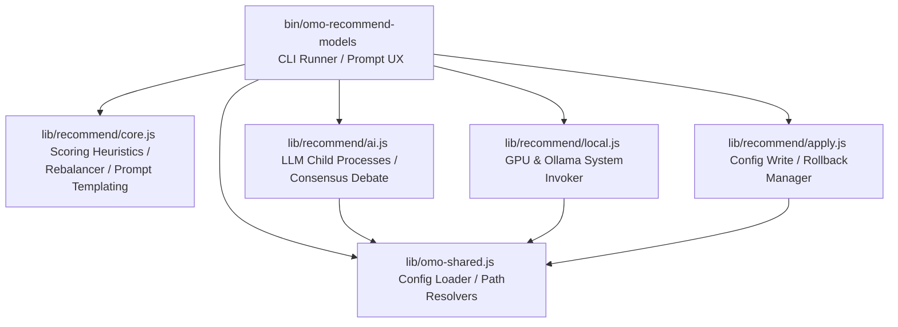

# Design Spec: NPX & ES Modules Modernization

**Date:** 2026-06-27  
**Status:** Under Review (Revised V2)  
**Topic:** Modernizing `omo-recommend-models` for NPX publishing, migrating to ES Modules, separating concerns, and upgrading the CLI UX.

---

## 1. Project Overview & Requirements
To support execution via `npx`, this codebase will be modernized to use ES Modules, have a clean separation between terminal I/O and core logic, start up instantly via lazy loading, use modern CLI prompt/spinner libraries, and support robust error and signal handling.

---

## 2. Package Configuration (`package.json`)
We will create a root `package.json` configured as a pure CLI package (omitting `"main"`):

```json
{
  "name": "omo-recommend-models",
  "version": "1.0.0",
  "description": "Consolidated AI-powered model recommendation CLI for OpenCode OMO agent configurations",
  "type": "module",
  "bin": {
    "omo-recommend-models": "./bin/omo-recommend-models"
  },
  "engines": {
    "node": ">=18.0.0"
  },
  "license": "MIT",
  "repository": {
    "type": "git",
    "url": "git+https://github.com/rajannpatel/omo-recommend-models.git"
  },
  "files": [
    "bin",
    "lib"
  ],
  "scripts": {
    "test": "node --test"
  },
  "dependencies": {
    "@clack/prompts": "^0.7.0",
    "mri": "^1.2.0",
    "picocolors": "^1.0.1"
  }
}
```

### ESM Migration Guidelines
1. **Module Scope**: Since `"type": "module"` is configured at the package root, all files (`bin/omo-recommend-models`, `bin/omo-validate-config`, `lib/omo-shared.js`, and tests under `test/`) will be migrated to ES Modules.
2. **Imports/Exports**: All internal files will use `import` and `export` statements with explicit `.js` extensions (e.g. `import { CONFIG_PATH } from '../lib/omo-shared.js'`).
3. **Core Library Imports**: Built-in Node.js modules must be imported with the `node:` prefix (e.g., `import fs from 'node:fs'`).
4. **Module Scope Variables**: Replace CommonJS `__dirname` and `__filename` usage with:
   ```javascript
   import { fileURLToPath } from 'node:url';
   import { dirname } from 'node:path';
   const __filename = fileURLToPath(import.meta.url);
   const __dirname = dirname(__filename);
   ```

---

## 3. Decoupled Architecture & Separation of Concerns
To separate terminal interactive behaviors from core platform interactions, the codebase will be split into the following modular components:



### Module Breakdown
*   **`bin/omo-recommend-models`**: Entry CLI script. Parses CLI options (via `mri`), manages `@clack/prompts` output (spinners, interactive questions), applies colors (via `picocolors`), and handles execution flow.
*   **`lib/omo-shared.js`**: Core config paths, JSONC parsing, and schema utilities.
*   **`lib/recommend/core.js`**: Pure mathematical heuristics for scoring, group sorting, rebalance calculation, and AI prompt building.
*   **`lib/recommend/ai.js`**: Orchestrates external LLM calls (executing `opencode run`), parses AI response JSON, handles rate limits (429 retries), and resolves consensus. Accepts progress callbacks to notify the CLI shell of work progress.
*   **`lib/recommend/local.js`**: System-level integration that queries local GPU/CPU hardware configurations and executes Ollama registry commands.
*   **`lib/recommend/apply.js`**: Orchestrates config backup file creation (`.pre-rebalance`), writing JSONC config updates, validating sibling `bin/omo-validate-config` execution, and performing rollbacks to restore backup configs on validation failure.

---

## 4. Subprocess Safety & Trust Boundaries

### Safe Execution with Argument Arrays
To prevent command injection vectors, all system invocations will default to safe array-based subprocess spawning:
*   `ollama pull ${modelName}` $\rightarrow$ `execFileSync('ollama', ['pull', model])`
*   `ollama rm ${m.name}` $\rightarrow$ `execFileSync('ollama', ['rm', m.name])`
*   `which ${adapter.binary}` $\rightarrow$ `execFileSync('which', [adapter.binary])`
*   `opencode run --pure --format json ...` $\rightarrow$ use `spawn` with clean arguments arrays in `lib/recommend/ai.js`.
*   Built-in CLI agents (`codex` and `agy`) will be refactored to execute using argument arrays rather than command strings.

### Configured Custom CLI Agents (`panel_cli_agents`)
The configuration schema allows users to customize CLI commands:
1.  **String Commands**: Configured `command` entries that are strings are explicitly designated as a **trusted local shell command** execution boundary. They will be run inside a shell context (using `/bin/sh -c` or similar) to preserve advanced command nesting/piping features.
2.  **Array/Safe Commands**: If the configuration supports an array structure or if the CLI parser is given an array of arguments, the process is spawned directly using `spawn` without shell execution.

---

## 5. CLI Argument Parsing & UX Upgrade

### Standardized Flags (using `mri`)
*   `-y` / `--yes`: Auto-accept all recommendations. Immediately runs the recommendation logic and applies updates without interactive queries.
*   `--rebalance`: Perform algorithmic tier-chain restructuring.
*   `--dry-run`: Output recommendations without updating the JSONC config.
*   `--cloud-only`: Skip local model discovery and Ollama integration.
*   `--local-only`: Skip cloud model discovery and API checks.
*   `--model <name>`: Explicitly specify AI models to use for the panel.
*   `--debug`: Print detailed stack traces for errors.

### TTY and CI Fallback Behavior
Interactive elements will dynamically adapt to the environment:
*   **Colorization**: `picocolors` naturally respects `NO_COLOR=1` or `process.env.NO_COLOR` to degrade to colorless plain text output.
*   **Non-Interactive Environments**: If `!process.stdout.isTTY || process.env.TERM === 'dumb' || process.env.CI === 'true'` is detected:
    *   Bypass interactive spinners and prompts.
    *   **Crucial Rule**: The execution will default to a **dry-run style preview mode** rather than acting like `--yes`. No configuration changes, model installs, or uninstalls will be applied unless `-y` or `--yes` is explicitly passed.

### Lazy Loading
*   Heavily styled packages like `@clack/prompts` will be loaded dynamically using `await import()` only when interactive TTY paths are active, keeping boot times optimal.

---

## 6. Robust Error Handling & SIGINT / SIGTERM
*   **Active Subprocess Tracking**: Maintain a registry of spawned child process handles.
*   **Signal Handling**: On `SIGINT` (Ctrl+C) or `SIGTERM`:
    1. Clean up only the specific temporary directory/files created by this process.
    2. Gracefully terminate all active registered child processes by sending `SIGTERM` first, waiting up to 2 seconds, and then killing any remaining children with `SIGKILL`.
    3. Gracefully exit with `process.exit(1)`.
*   **Global Catch**: Uncaught exceptions will print cleanly in red without stack traces, unless `--debug` is active.

---

## 7. Testing & Validation (NPX Check)
*   Convert `test/omo-recommend-models.test.js` to ES Modules.
*   Validate using `node --test` to ensure all existing behavior passes.
*   **NPX Verification Protocol**:
    1. Run `npm pack --dry-run` to inspect files listed in package boundaries.
    2. Create local package file: `npm pack` (generates `omo-recommend-models-*.tgz`).
    3. Execute dependency-free package smoke checks via `npx`; these must not require `opencode`, Ollama, GPU tooling, or a populated model cache:
       ```bash
       npx -y -p ./omo-recommend-models-1.0.0.tgz omo-recommend-models --help
       npx -y -p ./omo-recommend-models-1.0.0.tgz omo-recommend-models --version
       ```
    4. Execute the full AI recommendation integration check only on systems where the OpenCode CLI (`opencode`) is installed and on `PATH`:
       ```bash
       npx -y -p ./omo-recommend-models-1.0.0.tgz omo-recommend-models --dry-run --cloud-only --yes
       ```
    5. Confirm permission modes of `bin/omo-recommend-models` and sibling script `bin/omo-validate-config` retain execute permissions (`mode 755`).

---

## 8. Behavior-Preservation Checklist
The modernized implementation must preserve all original placement behaviors specified in `AGENTS.md`:
*   **No local models in routing arrays** (only in `fallback_models`).
*   **One local fallback model per agent** (highest scored fitting model).
*   **Semantic ordering** (first item is primary, later items are fallbacks).
*   **Stale panel cache rejection** (detect changed GPU configs or missing models, and re-run fresh).
*   **Validator rollback**: Ensure any validation failure automatically reverts the configuration file to the backup saved at `.pre-rebalance`.

---

## 9. Phased Implementation Sequencing
To minimize regression risks and ease debugging, implementation will follow this strict sequence:

1.  **Phase 1: Package setup & ES Modules migration**: Add `package.json`, convert all files to ESM, add `node:` prefix, and resolve path-handling. Run `node --test` and confirm existing integration tests pass with original structures.
2.  **Phase 2: Architectural decoupling**: Extract core logic into `lib/recommend/` (`core.js`, `local.js`, `ai.js`, `apply.js`). Ensure tests continue to pass.
3.  **Phase 3: CLI input, UX, & safety modernization**: Introduce `mri` argument parsing, safe subprocess spawning (with trusted shell fallback), TTY fallbacks, graceful signal cleanup flow, and Clack prompts/spinners. Re-run test suite.
4.  **Phase 4: NPM packaging & NPX validation**: Run the verification protocol to test local package install and execution.
